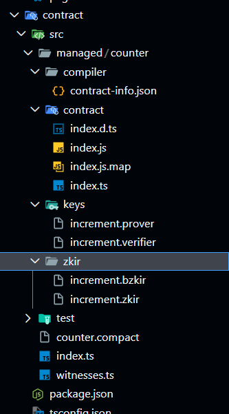
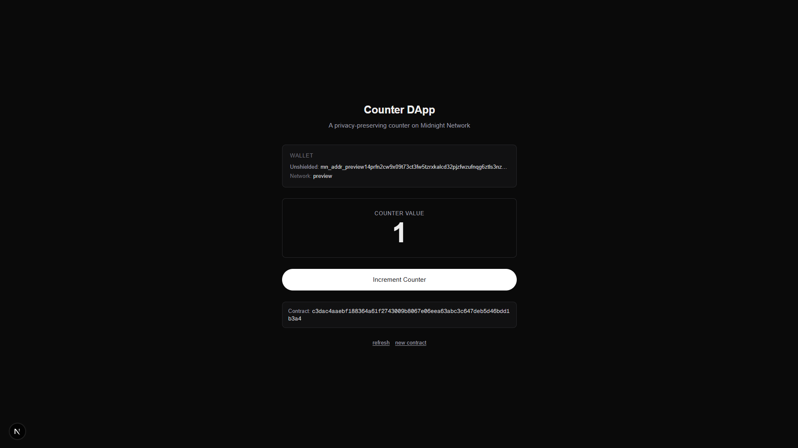

# Midnight Counter DApp

A full-stack counter dApp on [Midnight Network](https://midnight.network) powered by the [1AM Wallet](https://1am.xyz). Deploy a privacy-preserving counter smart contract, increment it, and query its state — all with zero gas fees via 1AM's ProofStation.

Built with Next.js 16, TypeScript, Tailwind CSS, and the Compact smart contract language.

## Product Idea

This counter dApp demonstrates the core privacy primitives of Midnight Network. Users deploy a smart contract with a public counter that anyone can read, while optionally maintaining private state (e.g. a `privateCounter`) that never leaves the user's device. The goal is to build toward a shared scoreboard or contribution tracker where participation is provable via zero-knowledge proofs, but individual contribution amounts remain private — useful for privacy-preserving community coordination, anonymous donation matching, or transparent-but-private governance voting.

## Deployed Contract

Deployed to **Preview** network:

```
c3dac4aaebf188364a61f2743009b8067e06eea63abc3c647deb5d46bdd1b3a4
```

## Screenshots

### Successful compile output


### DApp with deployed contract address


## Architecture

```
├── contract/
│   └── src/
│       ├── counter.compact      # Midnight Compact smart contract (ledger + circuit)
│       ├── witnesses.ts         # Private state type
│       ├── index.ts             # Re-exports compiled contract
│       └── managed/counter/     # Generated by compact compile
├── lib/
│   ├── midnight.ts             # 1AM wallet detection, session, providers, indexer patch
│   ├── counter.ts              # Deploy, increment, state decoding (non-blocking)
│   └── isomorphic-ws-fix.mjs   # WebSocket polyfill for Next.js webpack
├── app/
│   ├── page.tsx                # Landing page
│   └── counter/
│       ├── page.tsx            # Counter route (server shell)
│       └── CounterClient.tsx   # React client: connect → deploy/increment → poll state
├── public/zk/counter/          # ZK proving assets (prover + verifier keys)
└── ADDITION.md                 # Deviations from the 1AM skill guide
```

## Prerequisites

- **Node.js 22+** & npm
- **1AM browser extension** — install from [1am.xyz](https://1am.xyz)
- **Compact compiler** (for contract development):

```bash
curl --proto '=https' --tlsv1.2 -sSf \
  https://github.com/midnightntwrk/compact/releases/latest/download/compact-installer.sh | sh
source $HOME/.local/bin/env
```

## Getting Started

```bash
# 1. Install dependencies
npm install

# 2. Compile the Compact contract + sync ZK assets
npm run compile && npm run sync:assets

# 3. Start dev server (uses webpack for WASM support)
npm run dev
```

Open [http://localhost:3000/counter](http://localhost:3000/counter), connect the 1AM wallet, and deploy a counter contract.

## Build

```bash
npm run build
```

This compiles the contract, copies ZK assets to `public/`, then runs `next build`.

## How It Works

1. **Wallet connect** — detects the 1AM extension, creates a session with providers (ZK config, proof, wallet, indexer)
2. **Deploy** — uses `createUnprovenDeployTx` + `submitTxAsync` (non-blocking) to deploy the counter contract; returns the address immediately and polls the indexer for confirmation
3. **Increment** — calls the `increment` circuit via `submitCallTxAsync`, then polls for updated state
4. **State query** — fetches the raw contract state from the indexer's GraphQL API, deserializes via `ContractState.deserialize`, and extracts `round` from `Counter.ledger()`

Key SDK packages used: `@midnight-ntwrk/compact-runtime`, `@midnight-ntwrk/ledger-v8`, `@midnight-ntwrk/midnight-js-contracts`, `@midnight-ntwrk/compact-js`, `@midnight-ntwrk/midnight-js-fetch-zk-config-provider`, `@midnight-ntwrk/midnight-js-indexer-public-data-provider`.

## Public State vs Private Witness

Midnight separates on-chain data into two categories:

**Public state** (`ledger` in Compact) is stored on-chain and visible to everyone via the indexer. In this contract, `round: Counter` is public — anyone can query the current counter value. This is the transparent, auditable layer.

**Private witness state** is defined in `witnesses.ts` and lives only on the user's device. The `CounterPrivateState` type (containing `privateCounter`) is never committed to the chain. The ZK circuit can read and modify this local state while producing proofs that verify correctness without revealing the actual values.

This separation is Midnight's core value proposition: you get the auditability of a public ledger for data you *choose* to disclose, while keeping sensitive data cryptographically private. The `increment` circuit currently only modifies the public `round`, but the witness type is scaffolded to add private-only logic in future iterations.

## Networks

The dApp connects to **preprod** by default. Change the network in `app/counter/CounterClient.tsx`:

```ts
const api = await wallet.connect('preview');  // or 'preprod', 'mainnet'
```

The 1AM wallet handles network routing; indexer/RPC URLs come from `getConfiguration()`.

## Notes

- Transaction fees are **zero** — 1AM's ProofStation sponsors all DUST costs
- Contract state is polled from the indexer after deploy/increment (indexer can lag 10–60s on preprod)
- The indexer patch (`lib/midnight.ts`) works around a GraphQL `offset: null` bug on preview/preprod
- See `ADDITION.md` for deviations and fixes applied beyond the official 1AM skill guide
